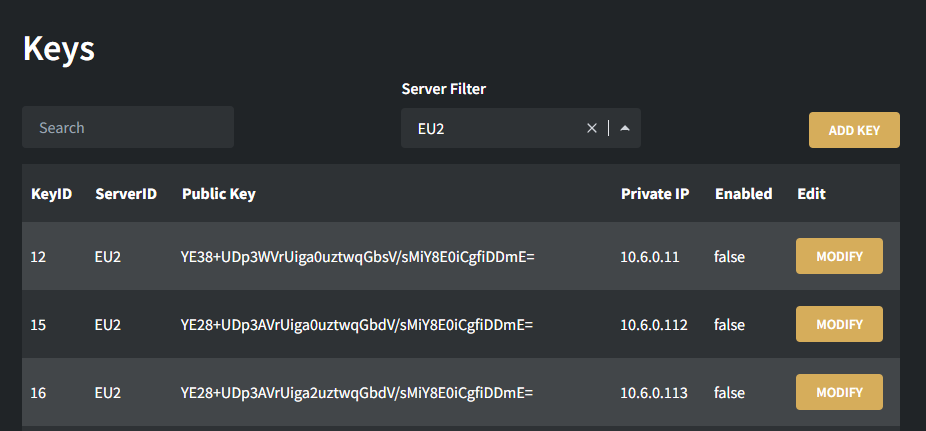
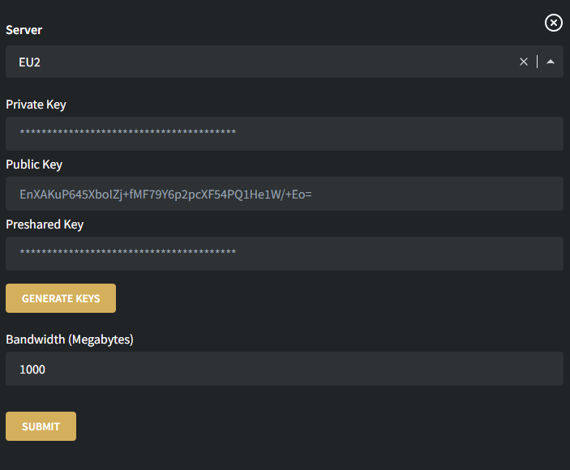

[](https://discord.gg/fXMzVqb3qB "Chat and get support from the team and community.")
[](https://app.netlify.com/start/deploy?repository=https://gitlab.com/mawthuq-software/wireguard-manager-gui)
[](https://vercel.com/new/clone?repository-url=https%3A%2F%2Fgitlab.com%2Fmawthuq-software%2Fwireguard-manager-gui&redirect-url=https%3A%2F%2Fgitlab.com%2Fmawthuq-software%2Fwireguard-manager-gui)


# Wireguard Manager GUI



Wireguard Manager GUI is used to interact with multiple backend [Wireguard Manager and API servers](https://github.com/Mawthuq-Software/wireguard-manager-and-api).


Preview the front-end [here](https://mawthuq-wg-manager-gui.netlify.app/) (the back-end is not running)
## Content
- [Wireguard Manager GUI](#wireguard-manager-gui)
  - [Content](#content)
  - [Deployment](#deployment)
    - [Docker](#docker)
      - [Starting the container](#starting-the-container)
      - [Editing your configuration](#editing-your-configuration)
    - [Building from source](#building-from-source)
  - [Configuration](#configuration)
  - [Security](#security)
## Deployment

We recommend [building from source](#building-from-source) and running the server locally on your machine. Currently this project is not secure to run remotely as there is no authentication.

The easiest way to get up and running is by deploying to Vercel or Netlify. Tap the button at the top of this readme to fork the repo and deploy the site for free. 

**Important:** Despite this being the easiest method we do **not** recommend it as there is no form of authentication and anyone with your URL can perform functions on your API server.

Proceed to the [configuration](#configuration) section.

###  Docker
Using docker is another quick way to get the project up and running on your machine.
#### Starting the container
1. ``git clone`` this repository
2. ``cd`` into the new directory
3. Copy the ``template.json`` and place it as ``config.json`` in the same directory
4. Edit the [configuration](#configuration) 
5. ``docker-compose up`` the project, this will build the docker image and run it. Use ``docker-compose -d`` to detach from the terminal. I recommend before detaching that you check everything builds fine.

#### Editing your configuration
After making any changes to ``config.json``, you will need to rebuild before bringing the docker-compose back up.

1. ``docker-compose build``
2. ``docker-compose up``. Use ``docker-compose -d`` to detach from the terminal.
### Building from source

1. Git clone this repository to a local machine
2. Enter the repo directory by using: ``cd (directory-name)``
   
3. Run the commands below:
```bash
# install dependencies
npm install

# build for production and launch server
npm run build
npm run start
```
4. If you would like to run the development server instead, use: ``npm run dev``
5. Proceed to the configuration section and configure your server.

## Configuration
1. Copy the ``template.json`` file and paste it as ``config.json`` in the same directory.
2. In the ``config.json`` there are the following variables:
   
| Variable | Purpose | Type |
| ------------ | ------------ | ------------ |
|directAccess|The method of transfer. Communicates directly with the endpoints|``object``|
|directAccess.ServerName|The name of the server. Must be unique.|``object``|
|directAccess.ServerName.url|The URL of the Wireguard Manager and API server|``string``|
|directAccess.ServerName.auth|The Authorization token for the Wireguard Manager and API server|``string``|
## Security

As emphasised before, this project is not currently secure as there is no authentication taking place on the front-end and the user. This is something that would be implemented at a later date, so for now its best to use this locally (without port forward, that just increases risk again.)

TLDR: Use this project locally. Manage your keys locally.


